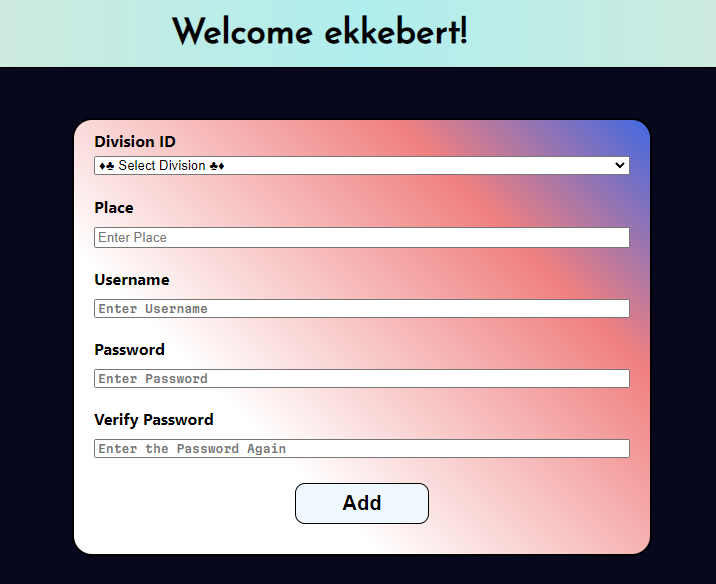

# CoolTech Credential Management System

**Table of Contents**

- [Author](#author)
- [Introduction](#introduction)
- [Resources](#resources)
- [Assumptions & Notes](#assumptions)
- [The Backend Port](#port)
- [Running the Application](#running)
- [Logging in as normal](#normal)
- [Logging in as management](#management)
- [Logging in as admin](#admin)
- [Usage](#usage)

## Author

<a href="https://github.com/HenriBranken" target="_blank">Henri Branken</a>

## Introduction

This application is a Credential Management system, for the CoolTech Company, that caters for users of various roles across different Units and Divisions.

- Normal Users are allowed to add a new credential to a Unit+Division combination.
- Management Users can do the above, as well as update the `Username` & `Password` for an existing "Credential".
- Admin Users can do the above, as well as update the role of an Employee, and/or change the divisions that an Employee is assigned to.

## Resources

Please look at pages **4** and **5** of **`DB_Structure_L4T35.pdf`** to see the `Username` & `Password` (of existing Employees) in order to log into the app. Look at the right-most column to see what **role** the employee has. These credentials cannot be inferred from querying MongoDB since it stores the **hashed** passwords (for security reasons).
Of course, an alternative would be to register as a new user and log in via that route, but that won't allow you to test all the functionality of the app.

## Assumptions & Notes

- Unit+Division combo is interchangeable with Division (for the sake of brevity).
- When a new user registers, he is only assigned to 1 Division as a start. Furthermore, he has a "normal" role. When registering, the user cannot decide his role.
- Employees can belong to as many divisions as possible. For the sake of brevity, I assigned employees to a maximum of 3 divisions. Feel free to add more if you want to experiment.
- The Admin page contains all the employees who has at least 1 division corresponding with that of the logged-in Admin.
- The instructions were not entirely clear on the scope of an Admin. In the `AdminEdit.js` page, you will see that an Admin can assign an Employee to a division that the admin does not belong to. Doing otherwise felt very restricted for me, which is why I decided on this approach.
- In the case of multiple divisions, it is assumed that the Employee has the **same role** across all the divisions.
- You will notice that sensitive information is stored inside **`backend/.env`** as environment variables. This is done for the sake of added security.
- I have decided not to implement Git Version Control for this task.

## The Backend Port

The Backend Port can be configured at the following places if needed:

- `/backend/.env/` -> **BACKEND_PORT**
- `/frontend/package.json` -> **"proxy"**

Currently, it is configured to be port **`8000`**.

## Running the application

- Navigate to the **`backend`** folder.
  - Spin up a terminal and execute: **`npm install`**
  - After successful installation, execute the following from the same terminal: **`npm start`**
  - The database is "ready" if you see **> Mongo Connection Established.**
- Navigate to the **`frontend`** folder.
  - Spin up another terminal and execute: **`npm install`**
  - After successful installation, execute the following from the same terminal: **`npm start`**
  - This will run the app which you can open at [http://localhost:3000](http://localhost:3000) in your favorite browser.
  - Read pages **4** and **5** of **`DB_Structure_L4T35.pdf`** if you wish to log in as an existing Employee.

## Logging in as `normal`

Example Credentials: Use the _username_ of **`baldomar`** and the _password_ of **`afghanistan`**.

## Logging in as `management`

Example Credentials: Use the _username_ of **`nerva`** and the _password_ of **`antartica`**. Look out for the right-most column that contains the `Edit` button when logging in with a management role.

## Logging in as `admin`

Example Credentials: Use the _username_ of **`ekkebert`** and the _password_ of **`canada`**. Look out for the **`Admin`** Tab that pops up in the right-hand side of the navigation bar when logging in as an admin.

## Usage

Browse through the resources and try to:

- update existing credentials
- adding new credentials
- register as a new employee
- view all the employees belonging to an admin user
- update the role and divisions of an employee

See if the interactions have the intended outcome.
